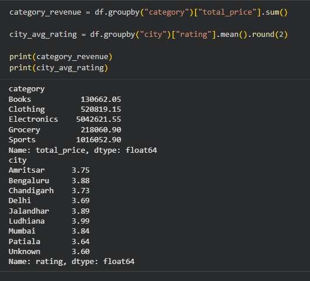
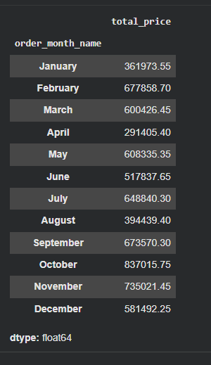
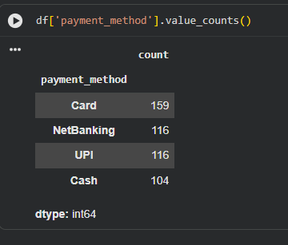
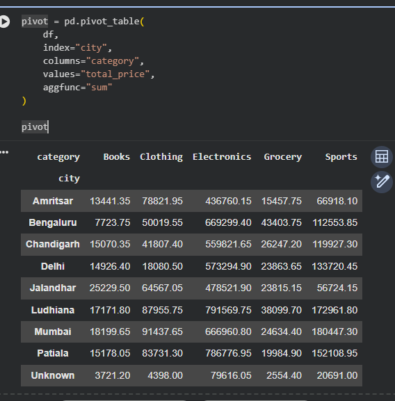

# Sales Data Analysis with Pandas & NumPy

A beginner-friendly practice project that cleans a messy sales dataset and analyses it using **Pandas** and **NumPy**.

## Dataset

`sales_practice.csv` has 508 rows and 11 columns of online store orders (Jan to Dec 2025).

| Column | Description |
|---|---|
| order_id | Unique order number |
| order_date | Date of order |
| customer_name | Customer identifier |
| age | Customer age |
| city | Customer city |
| category | Electronics, Clothing, Grocery, Books, Sports |
| unit_price | Price of one item |
| quantity | Items ordered |
| discount_pct | Discount percentage |
| payment_method | UPI, Card, Cash, NetBanking |
| rating | Customer rating (1 to 5) |

The data is intentionally messy: missing values, duplicate rows, negative prices and inconsistent city names.

## Tools Used

- Python 3
- Pandas
- NumPy
- Google Colab / Jupyter Notebook

## Data Cleaning Steps

| Problem | Fix |
|---|---|
| 20 missing `age` | Filled with mean, converted to int |
| 35 missing `rating` | Filled with mean |
| 8 missing `quantity` | Filled with mode |
| 10 missing `city` | Filled with `Unknown` |
| 5 negative `unit_price` | Rows dropped |
| 8 duplicate rows | Removed with `drop_duplicates()` |
| Inconsistent city names (`delhi` / `Delhi`) | Fixed with `str.title()` |

After cleaning, **495 rows** remain.

## Feature Engineering

```python
# Final amount after discount
df["total_price"] = (df["unit_price"] * df["quantity"] * (1 - df["discount_pct"] / 100)).round(2)

# Month columns
df["order_date"] = pd.to_datetime(df["order_date"])
df["order_month"] = df["order_date"].dt.month
df["order_month_name"] = df["order_date"].dt.month_name()

# Price label using NumPy
df["price_label"] = np.where(df["unit_price"] > 5000, "High", "Low")
```

## Analysis and Results

### 1. Category-wise revenue and city-wise average rating

```python
category_revenue = df.groupby("category")["total_price"].sum()
city_avg_rating = df.groupby("city")["rating"].mean().round(2)
```



- **Electronics** earns by far the most revenue (about 50.4 lakh), because its items are the most expensive.
- **Books** earns the least (about 1.3 lakh).
- **Ludhiana** has the highest average rating (3.99).

### 2. Month-wise sales

```python
df.groupby("order_month_name", observed=True)["total_price"].sum()
```



- **October** is the best month (8,37,015.75).
- **April** is the weakest month (2,91,405.40).
- Month names are stored as an ordered categorical so they appear in calendar order instead of alphabetical order.

### 3. Payment method popularity

```python
df["payment_method"].value_counts()
```



- **Card** is the most used method (159 orders).
- NetBanking and UPI are tied (116 each), and Cash is the least used (104).

### 4. Pivot table: city vs category revenue

```python
pd.pivot_table(df, index="city", columns="category", values="total_price", aggfunc="sum")
```



- **Ludhiana** has the highest Electronics revenue (7,91,569.75), followed closely by **Patiala** (7,86,776.95).
- Electronics dominates in every city.

### 5. Top 10 orders by value

Highest order: **order 1465** with 1,42,875.00, followed by orders 1426 and 1310. All top orders are Electronics.

## NumPy Analysis of `unit_price`

| Statistic | Value |
|---|---|
| Mean | 4860.83 |
| Median | 1424.00 |
| Standard deviation | 7179.59 |
| 25th percentile | 669.00 |
| 75th percentile | 5399.50 |

The mean is much higher than the median, so prices are right-skewed (a few expensive items pull the average up).

### Correlation between price and quantity

```python
np.corrcoef(df["unit_price"].to_numpy(), df["quantity"].to_numpy())
```

Result: **r = 0.088**, which means there is practically no linear relationship between price and quantity in this dataset.

## Key Insights

- Total revenue after cleaning: **69,28,216.55** across 495 orders.
- Electronics drives most of the revenue because of its high unit prices.
- Sales peak in October and dip in April.
- Price does not influence how many items a customer buys (synthetic data).

## Project Structure

```
.
├── README.md
├── pd_np_project.ipynb
├── sales_practice.csv
└── images/
    ├── 01_category_revenue_city_rating.png
    ├── 02_monthly_sales.png
    ├── 03_payment_methods.png
    └── 04_pivot_city_category.png
```

## How to Run

1. Open `pd_np_project.ipynb` in Google Colab or Jupyter.
2. Upload `sales_practice.csv` (in Colab, the first cells use `files.upload()`).
3. Run all cells from top to bottom.

## Author

Harsh, B.Tech CSE student
